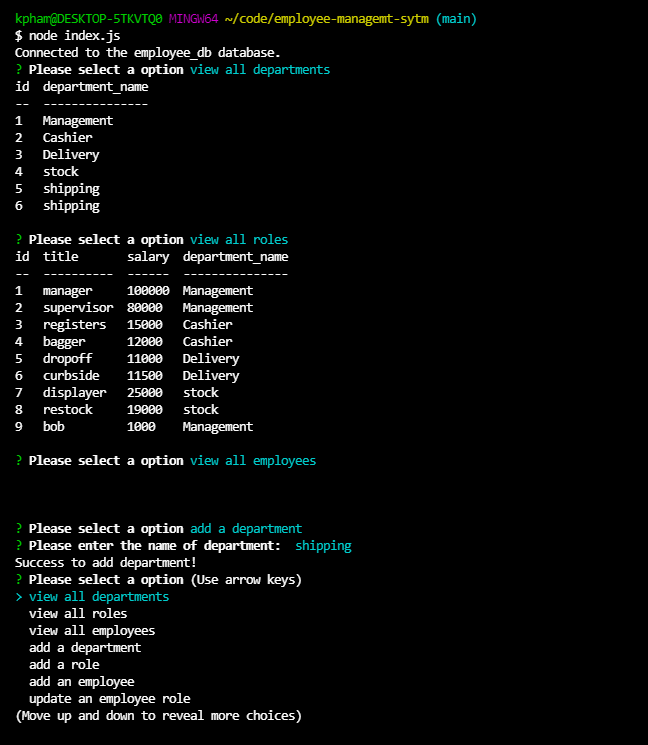

# Employee Management System

 

## Tech used
- Node.js
- MySQL
- Inquirer
- JSON

 

## Description
Build a command-line application to manage a company's employee database, using Node.js, Inquirer, and MySQL.
Business owner should be able to view and manage the departments, roles, and employees in the company.

## Sceenshot

## Walkthrough video
